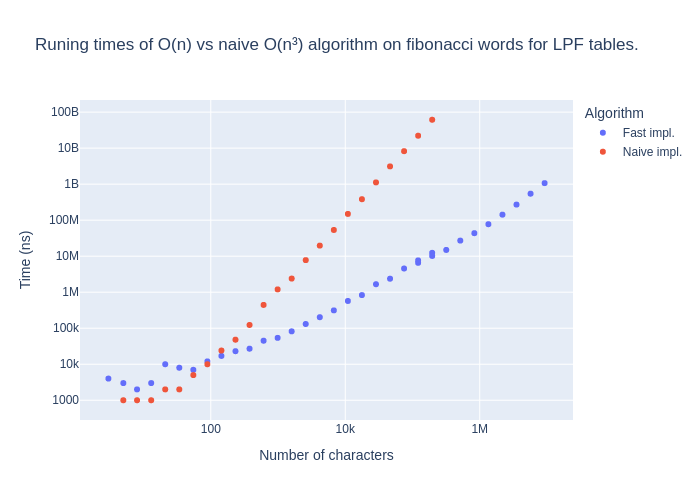
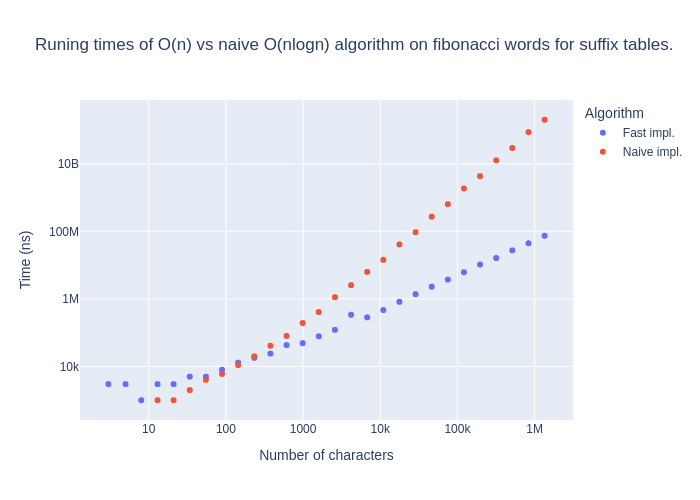

# Longest previous substring

For a given string w[1..n] we define an array LPF[1..n]. LPF[i] is the
largest k such that w[i..i + k − 1] occurs starting somewhere on the
left of i: w[i..i + k − 1] = w[i′..i′ + k − 1] with i′ < i (the previous
occurrence is allowed to overlap with w[i..i + k − 1]).

The LPF table can be then used to calculate the self-referential LZ parse of the input string.

### Example
Given the string: w[1...28] := `ababbababaaabbababaabaabbbaa`, LPF[13] = 8

<pre>
# For position 13 the longest previous substring occurrs on position 4

ababbababaaa <b>bbababaa</b> baabbbaa w[13...13 + 8 - 1]
aba <b>bbababaa</b> abbababaabaabbbaa w[4...4 + 8 - 1]
</pre>

## Results




## Build 

```
make 
```

```
Usage: ./lpf [options]
Options:
    -h, --help                                        Display this help message
    -l, --lpf                                         Calculate the lpf array
    -s, --suffix                                      Calculate the suffix and lcp arrays
    -v, --validate [sl][fr] <length> <tries> <asize>  Validate the [sl] agains the naive method <tries> random strings of length <length>
    -b, --benchmark [sl][fr] <length> <tries> <asize> Perform a benchmark with a random string[1...<length>], <tries> times
    Example:
        ./PATH/TO/PROGRAM/lpf -b lr 1000000 10 2    runs a benchmark of the lpf algorithm on random strings of length 1000000, 10 times, with alphabet size 2
        ./PATH/TO/PROGRAM/lpf -s                    presents a user input and calculates the suffix array 
```
